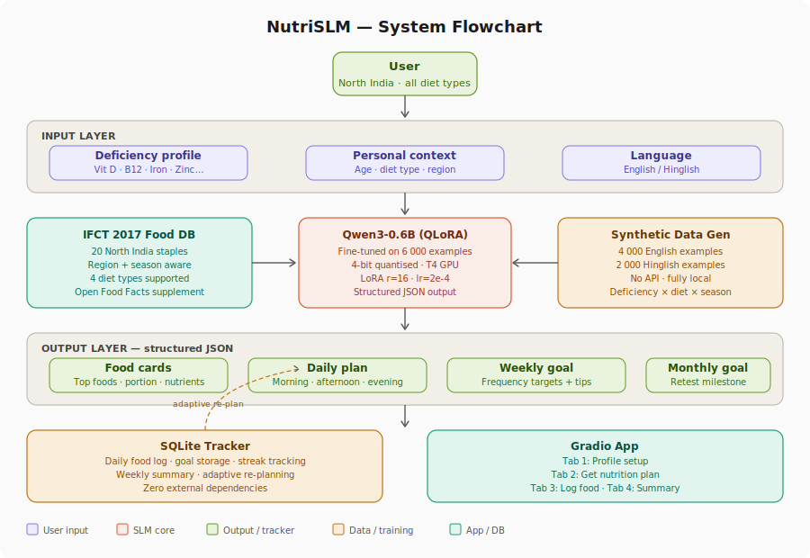

# NutriSLM — North India Nutrition & Deficiency Advisor


## Overview

NutriSLM fine-tunes **Qwen3-0.6B** using QLoRA on a synthetic dataset of 6,000 instruction-tuning examples covering 7 vitamin/mineral deficiencies, 4 diet types, and North Indian regional foods from the IFCT 2017 database.

Given a user's deficiency profile, diet type, and region, the model outputs:
- Ranked food suggestions with portion sizes and nutrient info
- A structured daily meal plan
- A weekly frequency goal
- A monthly retest milestone

All output is structured **JSON** — making it trivial to wire into any app or tracker.

| Property | Value |
|---|---|
| Base model | `Qwen/Qwen3-0.6B` |
| Fine-tuning method | QLoRA (4-bit, LoRA r=16) |
| Training examples | 6,000 (4k English + 2k Hinglish) |
| GPU required | T4 (free Colab tier) |
| Training time | ~40 min on T4 |
| Inference time | ~30 sec/query on T4 |
| Languages | English + Hinglish |
| Region | North India (Delhi, Punjab, UP, Haryana) |
| Diet types | Vegetarian · Non-vegetarian · Vegan · Jain |

---

## System flowchart



The dashed arrow shows the **adaptive re-planning loop** — after a user logs meals for a week, the tracker feeds their progress back into the SLM to regenerate an updated plan.

---

## Features

- **Region-aware food suggestions** — foods are filtered by North Indian availability, season (summer / winter / monsoon), and diet type
- **Hinglish input support** — users can query in mixed Hindi-English; the model always outputs structured English JSON
- **Structured JSON output** — every response follows a fixed schema: `top_foods`, `daily_plan`, `weekly_goal`, `monthly_milestone`
- **SQLite daily tracker** — logs meals, stores goals, and surfaces weekly summaries with zero external dependencies
- **Adaptive re-planning** — weekly progress is fed back to the model to adjust the next week's goal
- **Gradio UI** — 4-tab app with profile setup, plan generation, food logging, and weekly summary
- **MLflow experiment tracking** — logs hyperparameters and loss curves locally
- **HuggingFace Hub ready** — one-click push of LoRA adapter weights

---

## Project structure

```
nutrislm/
│
├── nutri_slm_demo.py       # Main script — all sections in one file
├── requirements.txt        # Pinned dependencies
├── .gitignore
├── LICENSE                 # MIT
│
├── assets/
│   └── flowchart.svg       # System architecture diagram (used in README)
│
├── data/                   # (gitignored) Generated training data lands here
├── models/                 # (gitignored) Fine-tuned adapter weights land here
└── notebooks/              # (optional) Exploratory Jupyter notebooks
```

---

## Quick start

### Option A — Google Colab (recommended)

1. Open [Google Colab](https://colab.research.google.com)
2. Set runtime: `Runtime → Change runtime type → T4 GPU`
3. Upload `nutri_slm_demo.py` via the Files panel
4. Run in a cell:

```python
!python nutri_slm_demo.py
```

Total time: **~55 minutes** from scratch to running Gradio app.

### Option B — Run section by section

Each `# === SECTION N ===` block in `nutri_slm_demo.py` is self-contained. Paste each section into a separate Colab cell for step-by-step control.

### Option C — Local (Linux, CUDA GPU required)

```bash
git clone https://github.com/YOUR_USERNAME/nutrislm.git
cd nutrislm
pip install -r requirements.txt
python nutri_slm_demo.py
```

> **Note:** Requires a CUDA-capable GPU with at least 8GB VRAM for 4-bit inference.

---

## How it works

### Step 1 — Food database
The `FOOD_DB` list (Section 2) contains 20 North Indian foods drawn from IFCT 2017 (National Institute of Nutrition, India — public domain). Each entry contains:
- Nutrient values per 100g (Iron, Calcium, Vitamin D, B12, Zinc, Vitamin C, Omega-3)
- Diet type compatibility (`vegetarian`, `non-vegetarian`, `vegan`, `jain`)
- Season availability (`summer`, `winter`, `monsoon`, `all`)
- Regional tags (Delhi, Punjab, UP, Haryana)
- Hinglish name

### Step 2 — Synthetic data generation
Section 3 generates 6,000 instruction-tuning examples entirely locally — no API calls needed. The generator:
1. Samples a random `(deficiency, diet_type, region, season, age_group)` combination
2. Fills an English or Hinglish prompt template
3. Filters `FOOD_DB` to get matching foods
4. Builds a structured `daily_plan`, `weekly_goal`, and `monthly_milestone`
5. Wraps everything in Qwen3's chat format (`<|im_start|>` tokens)

**Example English prompt:**
```
I have Iron deficiency. I'm a vegetarian from Delhi. What should I eat?
```

**Example Hinglish prompt:**
```
Iron ki kami hai mujhe. Main Delhi mein rehta hoon, vegetarian hoon. Kya khaaon?
```

**Output JSON (both languages produce the same structured output):**
```json
{
  "deficiency": "Iron",
  "diet_type": "vegetarian",
  "region": "Delhi",
  "top_foods": [
    {
      "name": "Rajma (Kidney Beans)",
      "hinglish_name": "rajma",
      "portion": "1 katori cooked (100g)",
      "nutrients": {"Iron_mg": 2.9, "Protein_g": 8.7, "Zinc_mg": 1.2}
    }
  ],
  "daily_plan": {
    "morning":   "Palak (Spinach) (1 katori cooked)",
    "afternoon": "Rajma (Kidney Beans) (1 katori cooked)",
    "evening":   "Kala Chana (1 katori cooked)",
    "tip":       "Have lemon/amla with iron-rich meals to boost absorption."
  },
  "weekly_goal": "Include Palak at least 4x this week. Try Rajma every alternate day.",
  "monthly_milestone": "After 4 weeks of this plan, retest Iron levels. Target: reach normal range."
}
```

### Step 3 — QLoRA fine-tuning
Section 4–5 loads Qwen3-0.6B in 4-bit NF4 quantisation and attaches LoRA adapters to all attention and MLP projection layers. Training runs for 3 epochs with:

| Hyperparameter | Value |
|---|---|
| LoRA rank (r) | 16 |
| LoRA alpha | 32 |
| LoRA dropout | 0.05 |
| Learning rate | 2e-4 |
| LR scheduler | Cosine |
| Warmup ratio | 0.05 |
| Effective batch size | 16 (4 × grad_accum 4) |
| Max sequence length | 1024 tokens |
| Epochs | 3 |
| Precision | fp16 |

### Step 4 — Inference
Section 6 wraps inference in `run_inference()`. The function:
1. Builds a system + user prompt in Qwen3 chat format
2. Generates up to 600 new tokens with `temperature=0.7`, `top_p=0.9`
3. Extracts the JSON block from the assistant turn
4. Returns a parsed Python dict (or `{"raw_output": ...}` on parse failure)

### Step 5 — Tracker loop
Section 7 provides four SQLite functions:
- `upsert_user()` — create/update profile
- `log_food()` — append a food log entry
- `save_goals()` — persist daily/weekly/monthly goals
- `get_weekly_summary()` — fetch last 50 food log entries

The **adaptive re-planning loop** (dashed arrow in flowchart) re-calls `run_inference()` weekly with the user's food log prepended to the prompt, so the model can adjust the next week's goals based on what was actually eaten.

---

## Food database

| Deficiency | Vegetarian | Non-veg | Vegan | Jain |
|---|---|---|---|---|
| Iron | Palak, Rajma, Kala Chana, Methi | Chicken Liver | Kala Chana | Rajma, Methi |
| Vitamin D | Mushroom, Fortified Milk | Egg, Rohu Fish | Mushroom | Mushroom, Fortified Milk |
| Vitamin B12 | Dahi, Paneer | Egg, Mutton | Nutritional Yeast | Dahi, Paneer |
| Calcium | Ragi, Til, Lassi | Same | Ragi, Til | Ragi, Til, Lassi |
| Zinc | Pumpkin Seeds, Rajma | Mutton | Pumpkin Seeds | Pumpkin Seeds |
| Vitamin C | Amla, Guava | Same | Same | Same |
| Omega-3 | Alsi, Akhrot | Rohu Fish | Alsi, Akhrot | Alsi, Akhrot |

Source: [IFCT 2017 — National Institute of Nutrition, India](https://www.nin.res.in) (public domain)

---

## Gradio app

The Gradio UI (Section 8) has 4 tabs:

| Tab | What it does |
|---|---|
| **1. Setup profile** | Enter name, region (Delhi/Punjab/UP/Haryana), diet type |
| **2. Get nutrition plan** | Select deficiency, optional Hinglish notes → get food cards + goals |
| **3. Log today's food** | Log meal name + time → saved to SQLite |
| **4. Weekly summary** | View last 50 food log entries as a markdown table |

Launch with `share=True` for a public URL valid 72 hours. For permanent hosting, deploy to [HuggingFace Spaces](https://huggingface.co/spaces) (free).

---

## Known issues & fixes

### `KeyError: 'qwen3'`
Your `transformers` version is too old. Qwen3 support requires `>=4.51.0`.
```bash
pip install transformers==4.51.3
```

### `bitsandbytes CUDA binary not found` / `No module named 'triton.ops'`
The CPU-only wheel was installed. Fix:
```bash
pip install "bitsandbytes>=0.43.0" --prefer-binary
pip install triton
```
Then do `Runtime → Disconnect and delete runtime` in Colab to clear stale imports.

### `IndexError: list index out of range` in `make_goal_plan`
Fixed in current version — the function now pads the food list to at least 3 items before accessing indices.

---

## Roadmap

- [ ] Expand food database to 100+ foods (full IFCT 2017 import)
- [ ] Add South India, East India, and West India region support
- [ ] FAISS-based food similarity search for "foods similar to X"
- [ ] Evaluation script — BLEU, ROUGE-L, JSON validity rate vs base model
- [ ] HuggingFace Spaces deployment with persistent SQLite via cloud storage
- [ ] Multi-deficiency input (e.g. "I have both Iron and Vitamin D deficiency")
- [ ] Push fine-tuned adapter to HuggingFace Hub

---

## Research angle

**Paper title:** *NutriSLM-NI: A region-aware, diet-type-sensitive, bilingual sub-1B model for personalized micronutrient deficiency management in North India*

**Key contribution:** No existing nutrition NLP model encodes the `(deficiency, diet_type, region, season, language)` quintuple at SLM scale. The adaptive re-planning loop and structured JSON output make this directly deployable as a daily tracker backend.

**Evaluation metrics to report:**
- JSON validity rate (% of outputs that parse correctly)
- BLEU / ROUGE-L on held-out eval set
- Diet-type accuracy (does the model correctly exclude non-veg foods for vegan users?)
- Deficiency-food relevance score (human eval)

---

## Contributing

Contributions welcome. Good first issues:
- Adding more foods to `FOOD_DB` from IFCT 2017
- Writing the evaluation script
- Adding a new region (South India food matrix)
- Improving the Hinglish prompt templates

Please open an issue before sending a PR.

---

## License

MIT — see [LICENSE](LICENSE).

Data sources:
- **IFCT 2017** — National Institute of Nutrition, India (public domain)
- **Open Food Facts** — [ODbL license](https://opendatacommons.org/licenses/odbl/)
- **Qwen3-0.6B** — [Apache 2.0](https://huggingface.co/Qwen/Qwen3-0.6B)
